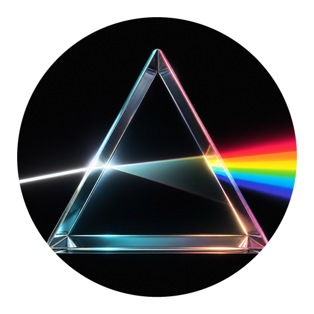
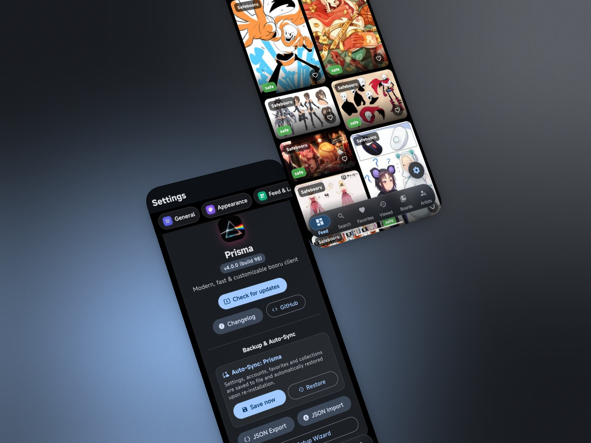

<p align="center">
  <a href="https://github.com/RarDog/Prisma">
    
  </a>
</p>

<h1 align="center">Prisma</h1>

<p align="center">
  <strong>A clean, fast, and modern cross-platform client for Booru imageboards and creator archives.</strong>
</p>

<p align="center">
  <strong>English</strong> • <a href="README_RU.md">Русский</a>
</p>

<p align="center">
  <a href="https://github.com/RarDog/Prisma/releases"></a>
  
  
  
</p>

<p align="center">
  
</p>

---

## ✨ Features

- **📱 Smooth Feed**: Pinterest-style masonry grid, 1:1 square grid, or compact list.
- **🎬 Smart Media Player**: Fullscreen auto-rotation, gesture controls, and smooth video playback.
- **🔍 Fast Tag Search**: Instant autocomplete, multi-tag queries (`and`), and rating filters.
- **🐾 Pawchive Sync**: Two-way favorites sync for Patreon, Fanbox, Discord, and creator platforms.
- **💾 Offline & Downloads**: Save images and videos with custom folder templates (`{Artist}/{ID}`).
- **🛡️ Content Filtering**: Custom blacklist/whitelist rules and safe mode.
- **🌑 AMOLED Theme**: Pure black dark mode optimized for OLED screens.
- **🔄 Auto-Updates**: In-app updater that automatically downloads the exact build for your device architecture.

---

## 🌐 Supported Sources

- **Safebooru**
- **Gelbooru**
- **Rule34**
- **e621 / e926**
- **Realbooru**
- **Pawchive**

---

## 📥 Download

Pre-built binaries are available on the **[Releases](https://github.com/RarDog/Prisma/releases)** page:

- **Android**:
  - `app-arm64-v8a-release.apk` — recommended for most modern phones (64-bit).
  - `app-armeabi-v7a-release.apk` — for older 32-bit Android devices.
  - `app-x86_64-release.apk` — for emulators and Chromebooks.
  - `app-release.apk` — universal fat APK for all Android devices.
- **Linux**:
  - `Prisma-v4.0.1-linux-x86_64.AppImage` — portable standalone executable.
  - `Prisma-v4.0.1-linux-x64.tar.gz` — portable tarball bundle.

---

---

## 🛠️ Build from Source

```bash
git clone https://github.com/RarDog/Prisma.git
cd Prisma
flutter pub get
flutter run
```

To build release APKs:
```bash
flutter build apk --release --split-per-abi
```

---

## ⚠️ Note & Vibe Coding

> [!NOTE]
> This project is 100% **vibe coding** created with an AI pair-programmer ([Antigravity / Gemini](https://deepmind.google/technologies/gemini/)). Built for personal fun and convenience. Feel free to open issues or PRs!
