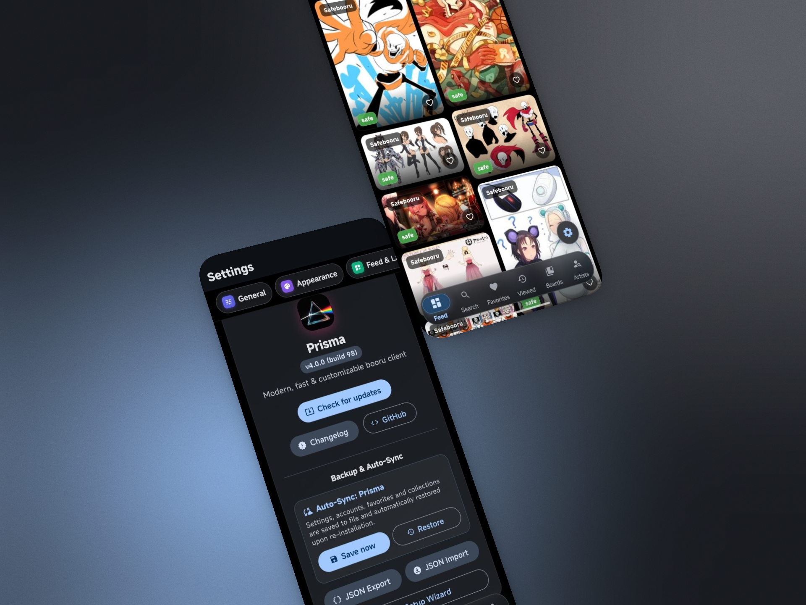

<p align="center">
  <a href="https://github.com/RarDog/Prisma">
    
  </a>
</p>

<h1 align="center">Prisma</h1>

<p align="center">
  <strong>High-performance, modern cross-platform client for Booru imageboards, creator archives, manga, and light novels.</strong>
</p>

<p align="center">
  <strong>English</strong> • <a href="README_RU.md">Русский</a>
</p>

<p align="center">
  <a href="https://github.com/RarDog/Prisma/releases"></a>
  
  
  
</p>

<p align="center">
  
</p>

---

## Overview

Prisma is a unified, resource-optimized multimedia viewer and catalog reader built with Flutter. It brings together popular booru imageboards, creator galleries, manga repositories, and light novel libraries into a cohesive, fluid Material 3 interface across Android, Linux, Windows, and macOS.

---

## Core Capabilities

### Media & Feed Browsing
- **Adaptive Layouts**: Pinterest-style masonry grid, fixed aspect ratio grids, and compact list modes.
- **Hardware-Accelerated Media Player**: High-definition video player powered by `media_kit` (mpv), featuring gesture-driven controls, audio track toggles, and seamless looping.
- **Deep Zoom & Notes Overlay**: Interactive high-resolution viewer with pinch-to-zoom, translation notes overlay, and multi-asset carousels.

### Manga & Light Novel Hub
- **Integrated Catalogs**: Direct access to titles from **MangaDex**, **MangaLib**, and **RanobeLib**.
- **Versatile Reading Modes**:
  - **Webtoon**: Smooth vertical continuous scroll with hardware-accelerated image pipeline.
  - **Manga Reader**: Traditional right-to-left (RTL) and left-to-right (LTR) page-by-page viewing.
  - **Light Novel Reader**: Dedicated typography engine with custom font scaling, line height, and reader color schemes.
- **Personal Library Management**: Track reading status (*Reading*, *Plan to Read*, *Completed*, *On Hold*, *Dropped*) with automated chapter progress synchronization and offline reading support.

### Tag Engine & Discovery
- **Sub-Millisecond Tag Autocomplete**: Instant search suggestions across millions of booru tags.
- **Complex Query Syntax**: Multi-tag queries, boolean exclusions (`-tag`), exact matching, rating filters, and source switching without resetting parameters.
- **Artist Hub**: Explore creator portfolios with direct integration into creator platforms.

### Performance & Memory Architecture
- **Sliding-Window Memory Management**: Active post carousel isolates memory consumption to immediate adjacent pages ($\pm 1$), aggressively evicting distant decoders from RAM.
- **Smart Memory GC & Watchdog**: Proactively responds to system memory pressure signals and keeps application footprint under tight control during extended browsing sessions.
- **Built-in Resource Monitor & Floating HUD**: Real-time diagnostic overlays displaying physical RSS RAM, Peak usage, image cache allocations, process CPU %, and engine frame rates (FPS).

### Offline Storage & Sync
- **Configurable Downloader**: Template-based file organization (e.g. `{Artist}/{ID}`) with integrated download manager.
- **Cross-Service Bookmarks**: Local collections, favorite posts, and Pawchive two-way synchronization.
- **Strict Content Filtering**: Global blacklist, whitelist, and discreet blur filters for sensitive material.

---

## Supported Sources

### Booru & Art Imageboards
| Provider | Protocol / API |
| :--- | :--- |
| **Gelbooru** | XML / JSON API |
| **Rule34** | Gelbooru-based API |
| **Safebooru** | Gelbooru-based API |
| **Realbooru** | HTML / Scraper |
| **e621 / e926** | Native REST API |
| **Pixiv** | Session Auth |
| **Pawchive** | Creator Sync |

### Manga & Light Novels
| Provider | Type | Content |
| :--- | :--- | :--- |
| **MangaDex** | Manga | International scanlations, multi-language chapter support |
| **MangaLib** | Manga | Comprehensive catalog with volume indexing |
| **RanobeLib** | Light Novel | Formatted text reader with rich chapter styling |

---

## Download

Pre-compiled production releases for each platform are available on the **[Releases](https://github.com/RarDog/Prisma/releases)** page:

### Android
- **[Prisma-4.1.6-arm64-v8a.apk](https://github.com/RarDog/Prisma/releases/download/v4.1.6/Prisma-4.1.6-arm64-v8a.apk)** — Recommended for modern smartphones and tablets (64-bit ARM).
- **[Prisma-4.1.6-armeabi-v7a.apk](https://github.com/RarDog/Prisma/releases/download/v4.1.6/Prisma-4.1.6-armeabi-v7a.apk)** — Legacy 32-bit Android devices.
- **[Prisma-4.1.6-x86_64.apk](https://github.com/RarDog/Prisma/releases/download/v4.1.6/Prisma-4.1.6-x86_64.apk)** — Android emulators, ChromeOS, and x86 devices.

### Linux
- **[Prisma-v4.1.6-linux-x86_64.AppImage](https://github.com/RarDog/Prisma/releases/download/v4.1.6/Prisma-v4.1.6-linux-x86_64.AppImage)** — Self-contained portable executable (requires `fuse` and `libmpv`).
- **[Prisma-v4.1.6-linux-x64.tar.gz](https://github.com/RarDog/Prisma/releases/download/v4.1.6/Prisma-v4.1.6-linux-x64.tar.gz)** — Standalone portable tarball bundle.

### Windows & macOS
- **[Prisma-v4.1.6-windows-x64.zip](https://github.com/RarDog/Prisma/releases/download/v4.1.6/Prisma-v4.1.6-windows-x64.zip)** — Portable 64-bit application archive.
- **[Prisma-v4.1.6-macos.zip](https://github.com/RarDog/Prisma/releases/download/v4.1.6/Prisma-v4.1.6-macos.zip)** — Standalone macOS app bundle.

---

## Building from Source

### Prerequisites
- [Flutter SDK](https://flutter.dev/docs/get-started/install) (3.24 or higher)
- [Dart SDK](https://dart.dev/get-dart) (included with Flutter)
- Platform toolchains:
  - **Android**: Android Studio / Command Line Tools, JDK 17
  - **Linux**: `clang`, `cmake`, `ninja-build`, `pkg-config`, `libgtk-3-dev`, `libmpv-dev`
  - **Windows**: Visual Studio 2022 with C++ Desktop Workload
  - **macOS**: Xcode 15+

### Build Steps
```bash
# Clone the repository
git clone https://github.com/RarDog/Prisma.git
cd Prisma

# Fetch package dependencies
flutter pub get

# Run application in debug mode
flutter run

# Compile production Android Split APKs
flutter build apk --release --split-per-abi

# Compile Linux Release Binary
flutter build linux --release
```

---

## License

This project is licensed under the [MIT License](LICENSE).
